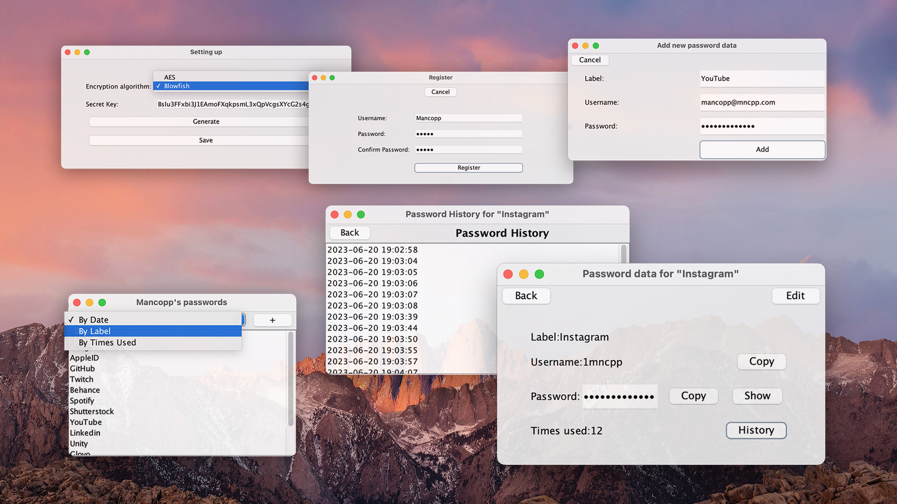

# PasswordManager

PasswordManager is a Java Swing application that allows users to securely store passwords for different accounts and services. The app follows an object-oriented programming (OOP) approach and employs the Model-View-Controller (MVC) architecture.

## Features

- **Password Storage**: Users can store passwords for various accounts and services.
- **Local Storage**: All data is stored locally on the user's computer.
- **Encryption**: User information and password records are encrypted for enhanced security.
- **Encryption Algorithms**: Users can choose between two encryption algorithms: AES or Blowfish.
- **256-bit Key Generation**: At the first launch, the user selects the encryption algorithm and generates a 256-bit key.
- **Data Storage**: Encrypted data is stored as a JSON file named "data.json".
- **User Information**: User details and password records are stored in the encrypted file "users.dat".

## How to Use

1. Launch the PasswordManager application.
2. Choose the desired encryption algorithm (AES or Blowfish) from the options provided.
3. Generate a 256-bit key.
4. Once the app is set up, you will be presented with the main interface to manage your passwords.
5. Use the intuitive UI to add, view, edit, or delete password records for your accounts and services.
